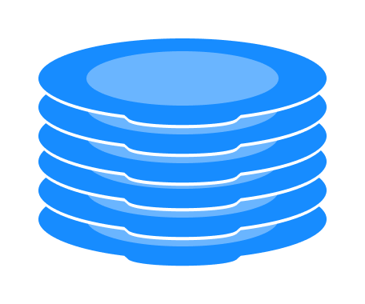

# 스택 데이터 구조
스택은 `LIFO(Last In First Out)` 원칙을 따르는 선형 데이터 구조입니다. 이것은 스택 내부에 삽입된 마지막 요소가 먼저 제거됨을 의미합니다.

스택 데이터 구조는 다른 플레이트 위에 플레이트 더미로 생각할 수 있습니다.

여기에서 다음을 수행할 수 있습니다.

- 그 위에 새 접시를 얹고
- 상판 제거
- 
그리고 바닥에 접시를 놓으려면 먼저 위에 있는 접시를 모두 제거해야 합니다. 이것이 바로 스택 데이터 구조가 작동하는 방식입니다.

# 스택의 LIFO 원리
프로그래밍 용어로 스택의 맨 위에 항목을 놓는 것을 푸시( **push** )라고 하고 항목을 제거하는 것을 팝( **pop** )이라고 합니다.

위 이미지에서는 항목 3 이 마지막에 저장되었지만 먼저 제거되었습니다. 이것이 바로 LIFO(후입선출) 원리가 작동하는 방식입니다.

