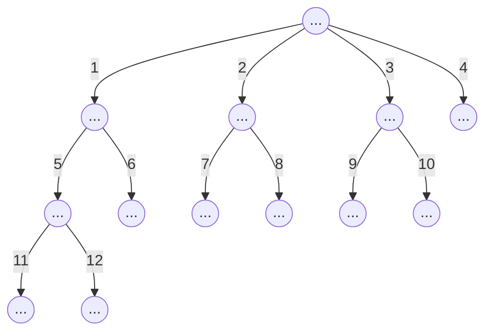
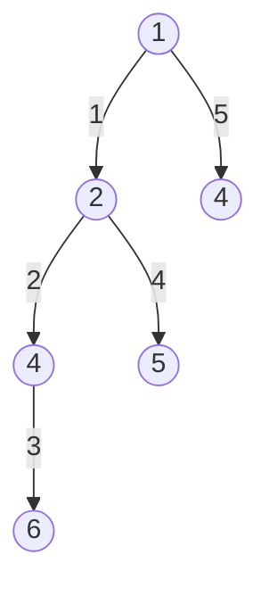

# BFS

> Queue

```mermaid
flowchart TD
    1((...)) --> |1|2((...))
    1((...)) --> |2|3((...))
    1((...)) --> |3|4((...))
    1((...)) --> |4|5((...))
    2((...)) --> |5|6((...))
    2((...)) --> |6|7((...))
    3((...)) --> |7|8((...))
    3((...)) --> |8|9((...))
    4((...)) --> |9|10((...))
    4((...)) --> |10|11((...))
    6((...)) --> |11|12((...))
    6((...)) --> |12|13((...))
```

# DFS

> Stack

```mermaid
flowchart TD
    1((1)) --> |1|2((2))
    1((1)) --> |5|3((4))
    2((2)) --> |2|4((4))
    2((2)) --> |4|5((5))
    4((4)) --> |3|6((6))
```
