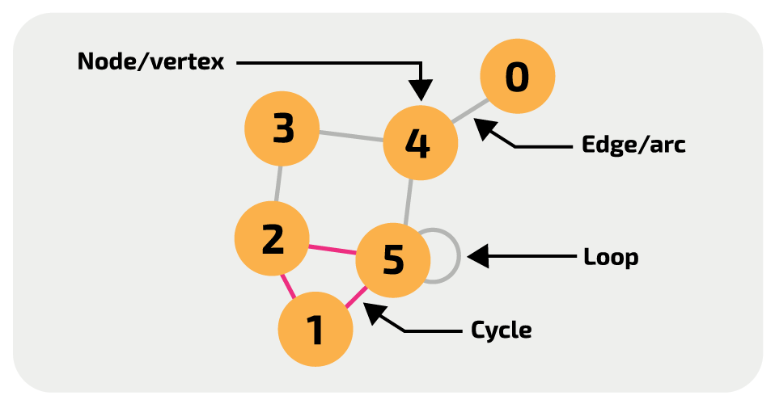

# Graph

> 컴퓨터 공학에서 말하는 그래프(graph)란 이산수학의 그래프 이론의 단방향 그래프(directed graph) 및 무향 그래프(undirected graph)의 개념을 적용하기 위해 가져온 추상적인 데이터 타입이다.
>
> 그래프는 비선형적 자료 구조(non-linear data structure)로 구분이 된다. n번째 값 뒤에 n+1이 정해지지 않은 (= 서로 단절되어 있는, 연속하는 것이 아닌) 구조라는 것이다.



## Graph 표현 방법

> Adjacency Matrix, Adjacency List

### Adjacency Matrix (인접 행렬)


|     | 1   | 2   | 3   | 4   |
| --- | --- | --- | --- | --- |
| 1   | 0   | 1   | 1   | 0   |
| 2   | 1   | 0   | 0   | 0   |
| 3   | 1   | 0   | 0   | 1   |
| 4   | 0   | 0   | 1   | 0   |

```js
[
  [0, 0, 0, 0, 0],
  [0, 0, 0, 0, 0],
  [0, 0, 0, 0, 0],
  [0, 0, 0, 0, 0],
  [0, 0, 0, 0, 0],
];
```

### Adjacency List (인접 리스트)


```json
{
  // 정점0에서 정점3과 정점6으로 향하는 간선이 있다는 뜻
  "0": [3, 6],
  "1": [0],
  "2": [0, 5],
  "3": [1, 4],
  "4": [1, 2],
  "5": [2, 3, 4]
}
```
