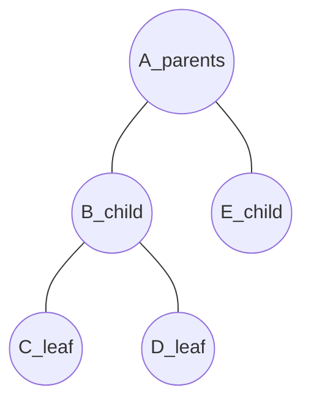
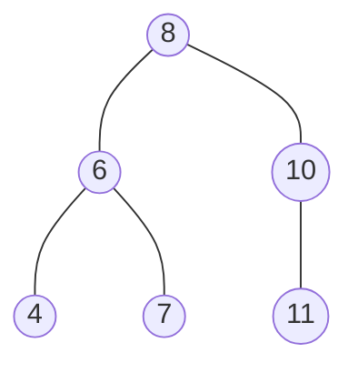
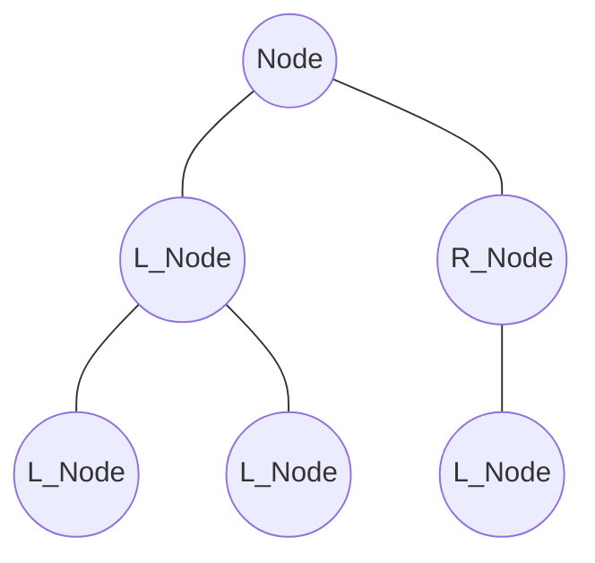
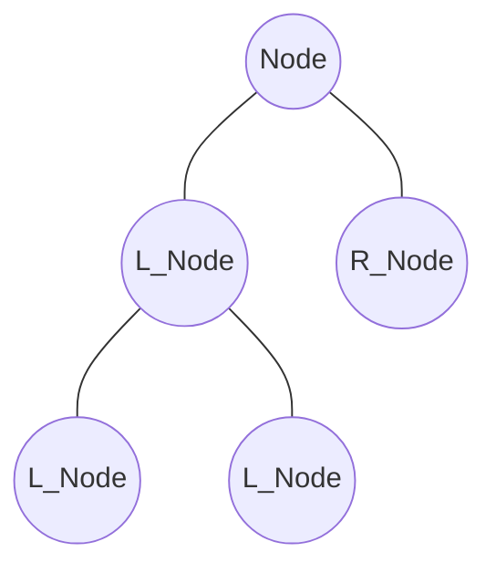
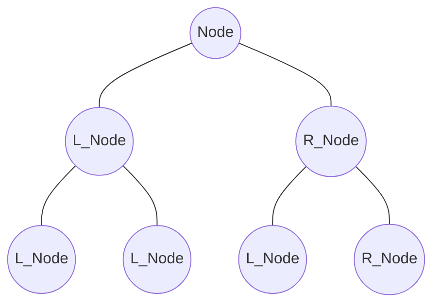

# Tree

> 부모 자식 관계를 가지는 데이터 구조  
> 계층, 그룹을 가짐

## Binary Tree `이진트리`

> 자식을 최대 2개 까지 가지는 트리
>
> - Ternary Tree : 자식을 3개 까지 가지는 트리

#### Binary Search Tree

> 왼쪽 노드와 그 이하 자식 노드들는 현재 노드보다 작아야하고,  
> 오른쪽 노드와 그 이하 자식 노드들은 현재 노드보다 커야 한다.

### Complete Binary Tree `완전 이진트리`

> 모든 노드들이 자식 레벨별로 왼쪽부터 채워져있다.

### Full Binary Tree

> 자식노드가 없거나 2개인 경우로만 구성된 트리

### Perfect Binary Tree

> 모든 노드가 레벨이 같고 자식이 두개인 트리

