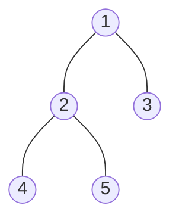

# Tree의 데이터를 가져오는 방법

> 모든 데이터를 가져오는 방법 3가지
>
> - Inorder, Preorder, Postorder

### Inorder

> Left &rarr; Root &rarr; Right
>
> - 4 &rarr; 2 &rarr; 5 &rarr; 1 &rarr; 3

### Preorder

> Root &rarr; Left &rarr; Right
>
> - 1 &rarr; 2 &rarr; 4 &rarr; 5 &rarr; 3

### Postorder

> Left &rarr; Right &rarr; Root
>
> - 4 &rarr; 5 &rarr; 2 &rarr; 3 &rarr; 1
