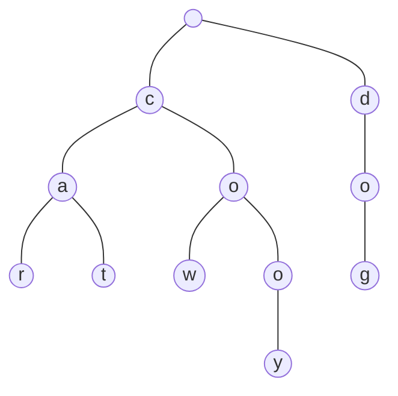

# Tries

> 문자열에서 검색을 빠르게 해주는 트리구조 `O(M)`
>
> 트라이(Trie)는 보통 Prefix Tree, digital search tree, retrieval tree라고도 부른다.  
> 트라이는 retrieval tree에서 나온 단어이다.

```mermaid
flowchart TD
    1(( )) --- 2((c)) & 3((d))
    2((c)) --- 4((a)) & 5((o))
    4((a)) --- 6((r)) & 7((t))
    5((o)) --- 8((w)) & 9((p))
    9((o)) --- 10((y))
    3((d)) --- 11((o))
    11((o)) --- 12((g))
```
